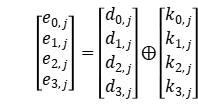
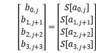

# Optimized_AES
An implementation of Advanced Encryption Standard with calculative optimization. Complete round operations in a single function.

## 任务目标

使用 AES 算法，实现一个加解密程序，使用的密钥长度固定为 128 位，分组长度为 128位，能够对任意长度的明文进行正确的加解密。 

实现过程中，需要进行充分优化以提高速度，考虑通过预先造表、计算时查表的方式回避复杂的二元域矩阵运算。

## 优化方案

### （1）AES加密的查表优化实现

考虑以下加密轮函数的结构：

 

如果把初始矩阵state记作a，经过每一个操作后的矩阵分别记为b，c，d，e，则可以对矩阵列的变化情况进行一些推导分析。从最后一步AddRoundKey开始，依次分析其如何由上一步变化而来：

（AddRoundKey）

（MixColumn）

（ShiftRow）

（ByteSub）

其中需要说明的是：下标j+1、j+2、j+3与教材中的内容有所出入，也是因为在进行实验时确实不能完全理解为何使用的是“-”号，最终采用了经过测试后能够成功加密解密的方案。另外j+1等下标需要对4取模。

将上述4式整合为1式，并表示成列向量的线性组合：

 

其中a0, j等就是矩阵中的各字节。由于前四项均为a的函数，可以通过建表T，在计算时直接根据a的值得到前四项，再与轮密钥异或即可。表达式及表结构如下：

    <1>

  <2>

这样，就得到了一个列e，用这个列替换原来列中的四个字节，直到将四个列都更新完成，进入下一轮迭代。这里，s[a] 02表示S[a]查表结果与0x02进行二元域的乘。

最后一轮迭代是不需要MixColumn的，列更新方式如下：

       <3>

至此，仅用查表和异或就可以实现加密算法的轮变换。对于AES，前9轮进行完整操作<1>，最后1轮使用<3>，故总共需要9*4*（4次查T表+4次异或）+4*（4次查S盒+4次异或）。这极大地提升了效率。

### （2）AES解密的查表优化实现

因为执行结构相同、每轮迭代中的动作顺序相同，解密算法中也可以用与上述完全一致的思路。只不过各步骤中要使用逆变换，包括S盒改为逆S盒（用S1表示）、行移动变换方向、列混合相乘矩阵改变。最终的实现方案是：

    <4>

  <5>

       <6>

## 优化结果

程序编写过程中使用的测试方法是对一个固定的分组进行反复加密。

与通过常规方式编写的aes_typical.c对比。仅以加密过程为例，对一个分组加密1000000次用时28.188秒；而优化后的aes_with_table.c用时为0.137s。
